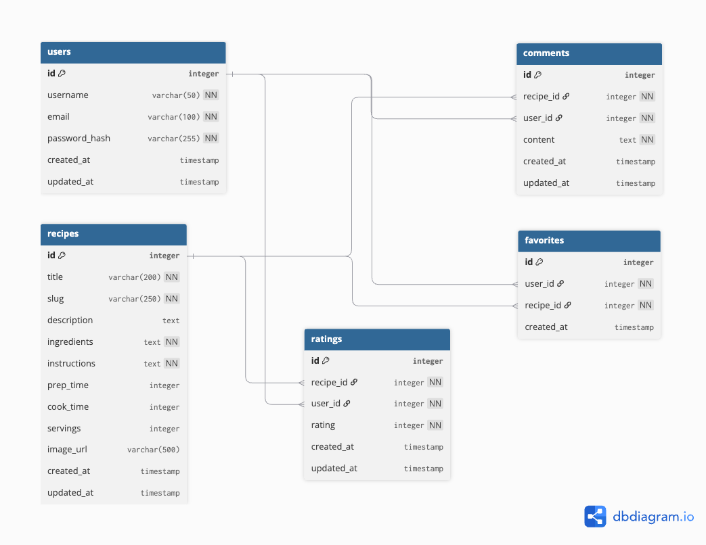

# Haus Kitchen

## Table of Contents
- [Project Overview](#project-overview)
- [Features](#features)
- [Tech Stack](#tech-stack)
- [Getting Started](#getting-started)
- [Usage](#usage)
- [Testing](#testing)
- [Entity Relationship Diagram (ERD)](#entity-relationship-diagram-erd)
- [Wireframes](#wireframes)
- [AI Usage](#ai-usage)
- [User Stories](#user-stories)
- [Credits](#credits)
- [License](#license)

## Project Overview
A brief description of the project, its goals, and what problems it solves.

## Features
- List key features of the application.

## Tech Stack
- **Backend:** Python, Django
- **Database:** (e.g., PostgreSQL, SQLite)
- **Frontend:** (e.g., HTML, CSS, JavaScriptl;.///
)


## Getting Started
### Prerequisites
- Python version
- Django version
- Other dependencies

### Installation
```bash
# Clone the repository
git clone <repo-url>
cd haus_kitchen

# Create and activate virtual environment
python -m venv venv
source venv/bin/activate

# Install dependencies
pip install -r requirements.txt

# Apply migrations
python manage.py migrate

# Run the development server
python manage.py runserver
```
## Deployment

## Usage
Instructions and examples for using the application.

## Testing
How to run tests, testing strategy, and coverage.
```bash
python manage.py test
```

## Entity Relationship Diagram (ERD)


## Wireframes


## AI Usage
Describe any AI/ML features, models, or APIs used in the project.

## User Stories
https://github.com/users/hauvoong/projects/9

## Credits
- List contributors, libraries, or resources to credit.

## License
Specify the license for your project.
# Haus-Kitchen
