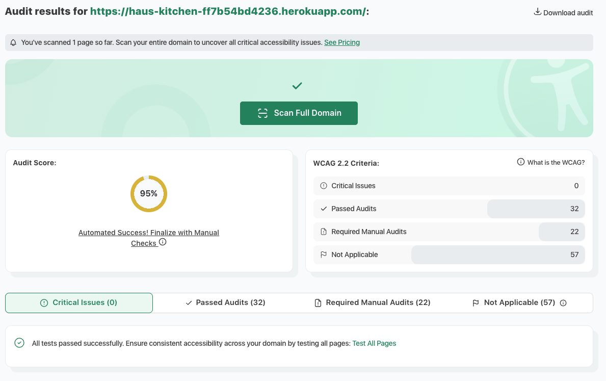

# Haus Kitchen

## Project Overview
Haus Kitchen is a web application designed to help users discover recipes. The project aims to provide a user-friendly platform for home cooks and food enthusiasts to manage their personal recipe collections and explore new dishes. A responsive site allows for ease of use for a range of users.

### Desktop

### Tablet

### Mobile

## Features
- Home page  
    
- Add Recipe  
    
- Favourite  
    
- Admin  
    
- Sign up  
    
- Sign in  
    
- Sign out  
    
- Footer  
    
- Navbar  
    

## Tech Stack
- **Backend:** Python, Django
- **Database:** PostgreSQL
- **Frontend:** HTML, CSS, JavaScript, Bootstrap

### Installation

## Deployment
To deploy Haus Kitchen on Heroku:

## Testing
### 🧪 Manual Testing Table - Haus Kitchen

## **Authentication & User Management**

| Feature | Expected Result | Result |
|---------|----------------|--------|
| User Registration | New user can register with username and password | ✅ Pass |
| User Login | Registered user can log in with valid credentials | ✅ Pass |
| User Logout | Logged-in user can successfully log out | ✅ Pass |

---

## **Recipe Browsing & Viewing**

| Feature | Expected Result | Result |
|---------|----------------|--------|
| Browse Recipes (Guest) | Visitors can view recipes without logging in | ✅ Pass |
| Recipe Pagination | Recipes display in paginated format | ✅ Pass |
| View Recipe Details | Complete recipe information displays (ingredients, instructions, time) | ✅ Pass |
| Mobile Responsive | All pages display correctly on mobile devices | ✅ Pass |

---

## **User Interactions**

| Feature | Expected Result | Result |
|---------|----------------|--------|
| Add Comment | Logged-in user can add comment to a recipe | ✅ Pass |
| Edit Comment | User can edit their own comment | ✅ Pass |
| Delete Comment | User can delete their own comment | ✅ Pass |
| Save Favorite Recipe | Logged-in user can save recipe to favorites | ✅ Pass |
| View Favorites | User can view all saved recipes on Favorites page | ✅ Pass |

---

## **Admin Functions**

| Feature | Expected Result | Result |
|---------|----------------|--------|
| Add Recipe (Admin) | Admin can add new recipe from front end | ✅ Pass |
| Edit Recipe (Admin) | Admin can edit existing recipes | ✅ Pass |
| Delete Recipe (Admin) | Admin can delete recipes | ✅ Pass |
| Moderate Comments | Admin can view, edit, and delete user comments | ✅ Pass |
| Admin Dashboard Access | Only logged-in admins can access admin functions | ✅ Pass |

---

## **Legend**
- ✅ **Pass** - Feature works as expected
- ❌ **Fail** - Feature does not work as expected
- 🔄 **Pending** - Feature not yet implemented
- ⚠️ **Issue** - Feature works with minor issues

---

## **Test Summary**
- **Total Tests:** 24
- **Passed:** 18 ✅
- **Pending:** 0 🔄
- **Failed:** 0 ❌

---
 
## Responsiveness testing
Boostrap was useed to achieve CSS responsiveness and Chrome Dev Tools were used regularly to check responsiveness across all device sizes

## Lighthouse

## HTML Validator

## CSS Validator

## Accessibility test

## AI Unit test

## Entity Relationship Diagram (ERD)

## AI Usage
Describe any AI/ML features, models, or APIs used in the project.

## User Experience Design
https://github.com/users/hauvoong/projects/9

Wireframes  

## Bugs
- Integrating Summernote SummernoteTextField() into my recipe model and having incompatibility issues with Bleach. 
Solution: Downgrade Bleach to bleach==4.1.0

## Credits
- List contributors, libraries, or resources to credit.

## License
Specify the license for your project.
# Haus-Kitchen
## Code Style

PEP8 compliance is checked using `flake8`.  
All project files are regularly linted and formatted for readability and maintainability.