# Haus Kitchen

## Project Overview
Haus Kitchen is a web application designed to help users discover recipes. The project aims to provide a user-friendly platform for home cooks and food enthusiasts to manage their personal recipe collections and explore new dishes. A responsive site allows for ease of use for a range of users.

Deployed site: https://haus-kitchen-ff7b54bd4236.herokuapp.com/

### Desktop
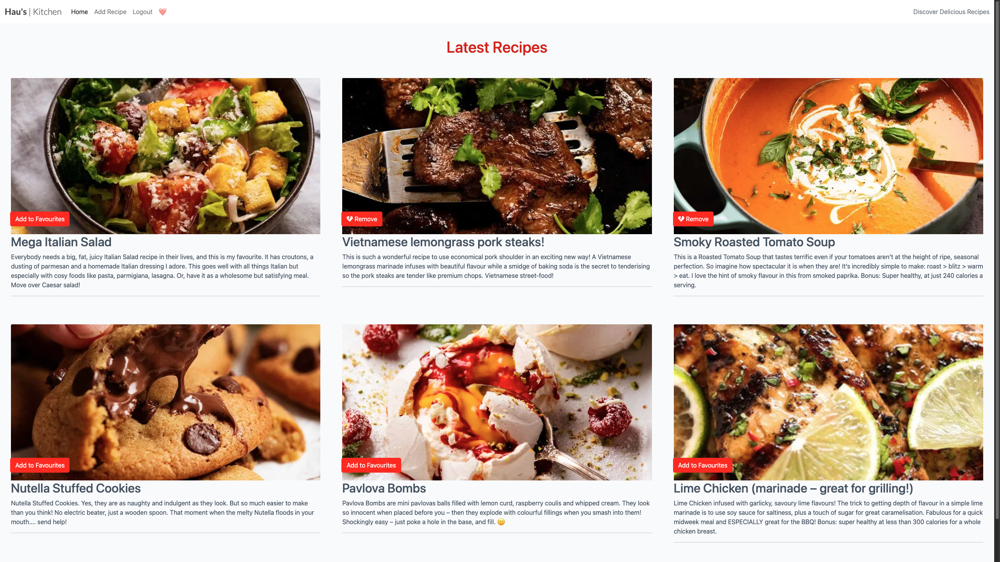

### Tablet
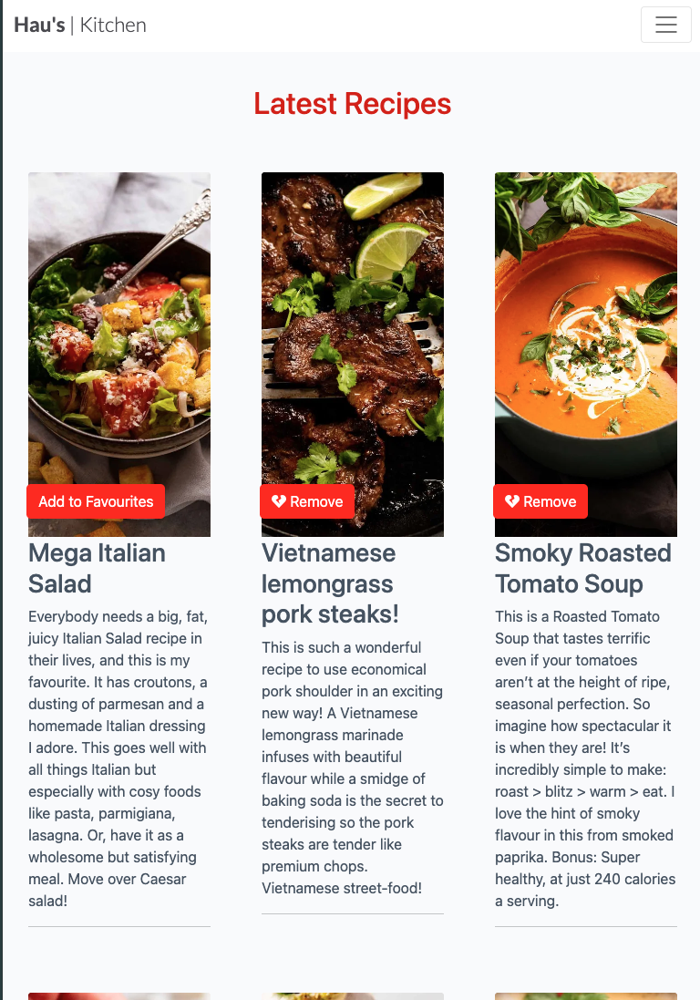

### Mobile
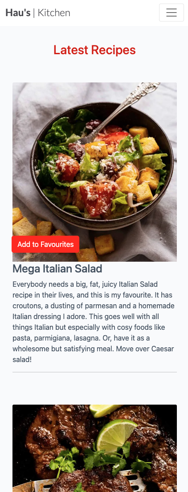

## Features
- Home page  
    
- Add Recipe  
    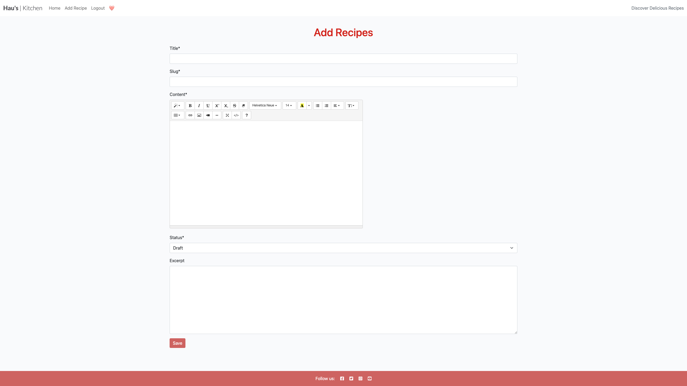
- Favourite  
    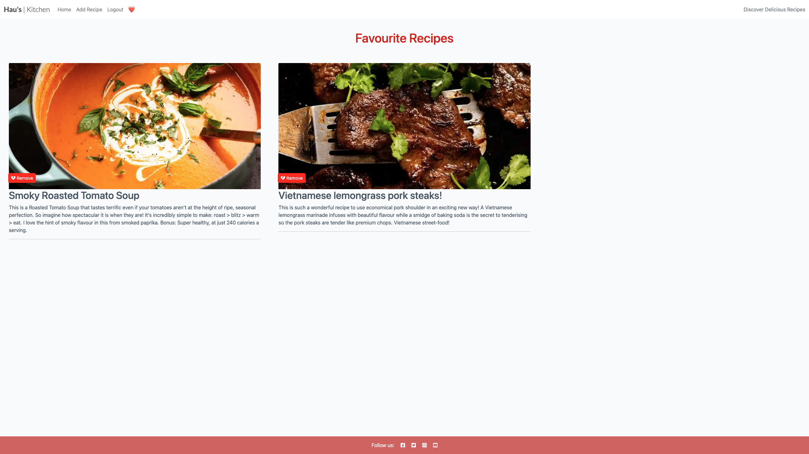
- Admin  
    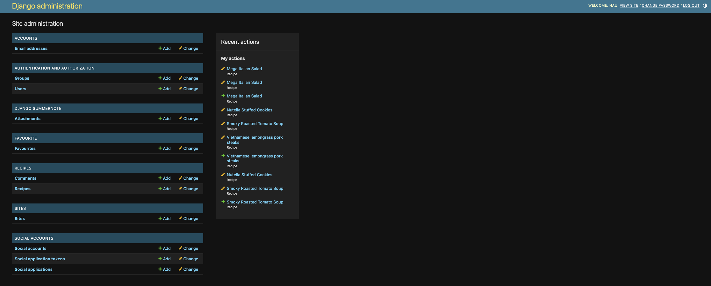
- Sign up  
    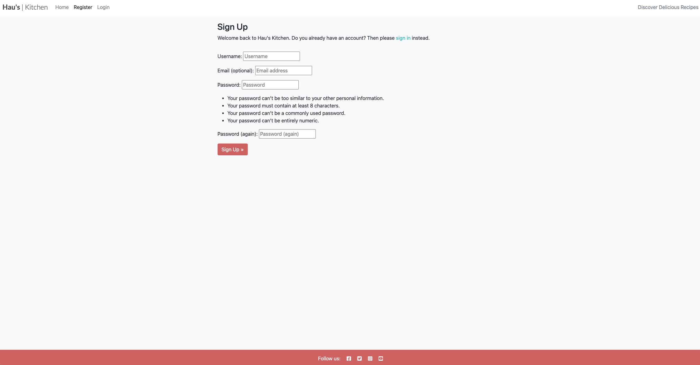
- Sign in  
    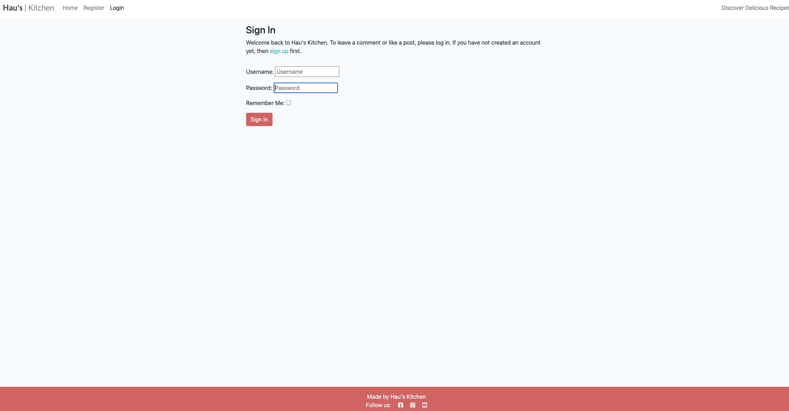
- Sign out  
    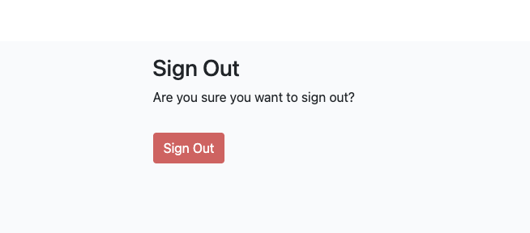
- Footer  
    
- Navbar  
    

## Tech Stack
- **Backend:** Python, Django
- **Database:** PostgreSQL
- **Frontend:** HTML, CSS, JavaScript, Bootstrap

### Installation

## Deployment
To deploy Haus Kitchen on Heroku:

The site is deployed to Heroku using continuous deployment from the main branch. 

**Steps to deploy on Heroku:**

1. In the Heroku dashboard, click **New** and select **Create new app**.
2. Enter a unique app name and choose your preferred region.
3. Click **Create app**.
4. In **Settings**, click **Reveal Config Vars** and add:
    - `DATABASE_URL`: PostgreSQL connection string (provided by ElephantSQL)
    - `SECRET_KEY`: Django secret key
    - `CLOUDINARY_URL`: Cloudinary image storage URL
    - `CLOUDINARY_API_KEY`: Cloudinary API Key
    - `CLOUDINARY_CLOUD_NAME`: Cloudinary name
    - `CLOUDINARY_SECURE`: true - This was to overcome Lighthouse accesibility issues
5. Go to the **Deploy** tab:
    - Connect to your GitHub account.
    - Select the repository.
    - Click **Deploy Branch** to start deployment.
6. Once deployment completes, launch the app from the dashboard.

## Testing
### 🧪 Manual Testing Table - Haus Kitchen

## **Authentication & User Management**

| Feature | Expected Result | Result |
|---------|----------------|--------|
| User Registration | New user can register with username and password | ✅ Pass |
| User Login | Registered user can log in with valid credentials | ✅ Pass |
| User Logout | Logged-in user can successfully log out | ✅ Pass |

---

## **Recipe Browsing & Viewing**

| Feature | Expected Result | Result |
|---------|----------------|--------|
| Browse Recipes (Guest) | Visitors can view recipes without logging in | ✅ Pass |
| Recipe Pagination | Recipes display in paginated format | ✅ Pass |
| View Recipe Details | Complete recipe information displays (ingredients, instructions, time) | ✅ Pass |
| Mobile Responsive | All pages display correctly on mobile devices | ✅ Pass |

---

## **User Interactions**

| Feature | Expected Result | Result |
|---------|----------------|--------|
| Add Comment | Logged-in user can add comment to a recipe | ✅ Pass |
| Edit Comment | User can edit their own comment | ✅ Pass |
| Delete Comment | User can delete their own comment | ✅ Pass |
| Save Favorite Recipe | Logged-in user can save recipe to favorites | ✅ Pass |
| View Favorites | User can view all saved recipes on Favorites page | ✅ Pass |

---

## **Admin Functions**

| Feature | Expected Result | Result |
|---------|----------------|--------|
| Add Recipe (Admin) | Admin can add new recipe from front end | ✅ Pass |
| Edit Recipe (Admin) | Admin can edit existing recipes | ✅ Pass |
| Delete Recipe (Admin) | Admin can delete recipes | ✅ Pass |
| Moderate Comments | Admin can view, edit, and delete user comments | ✅ Pass |
| Admin Dashboard Access | Only logged-in admins can access admin functions | ✅ Pass |
 
## Responsiveness testing
Boostrap was useed to achieve CSS responsiveness and Chrome Dev Tools were used regularly to check responsiveness across all device sizes

## Lighthouse
I looked into the Best Practice score, Lighthouse test doesn't like the Cloudinary image setup and a suggested fix is to have the files self hosted.

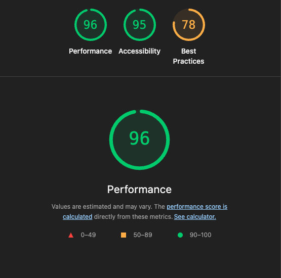
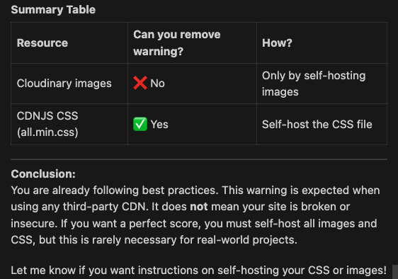

## HTML Validator
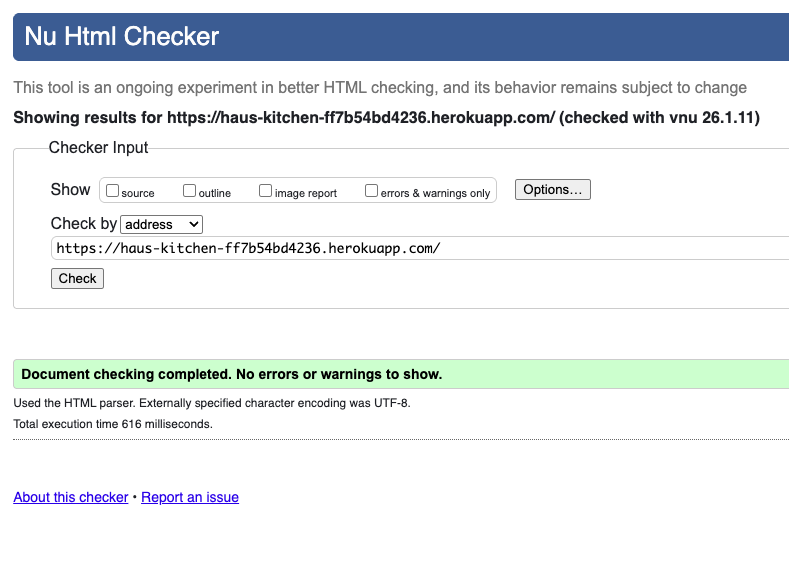

## CSS Validator
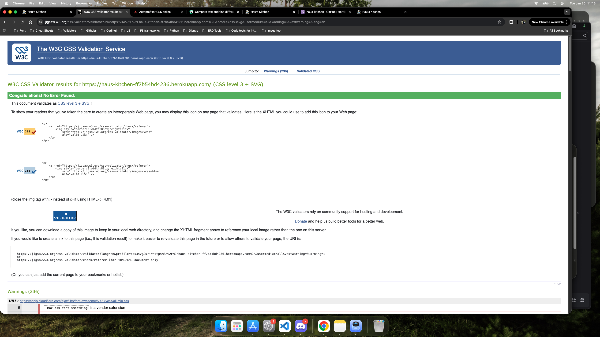

## AI Unit test
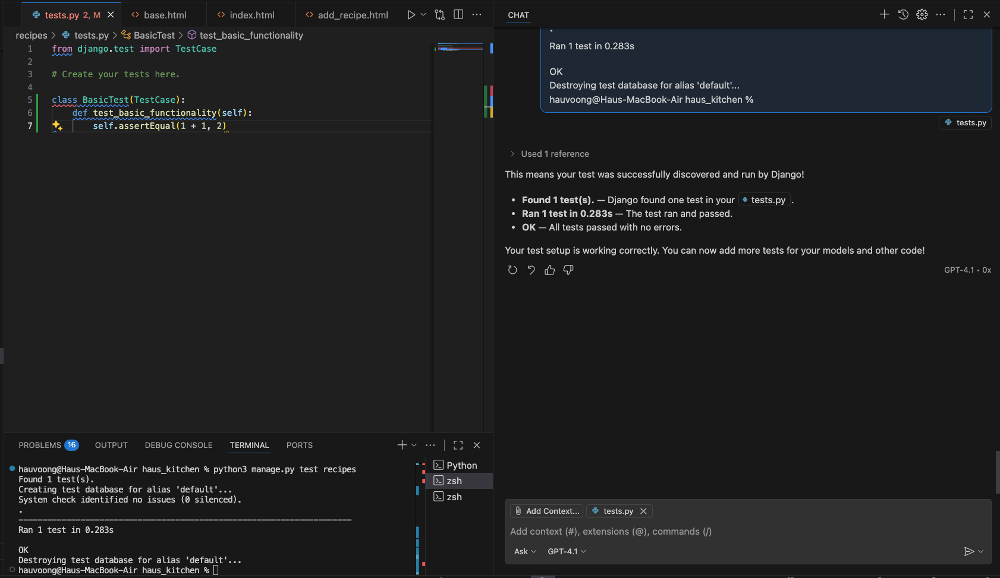
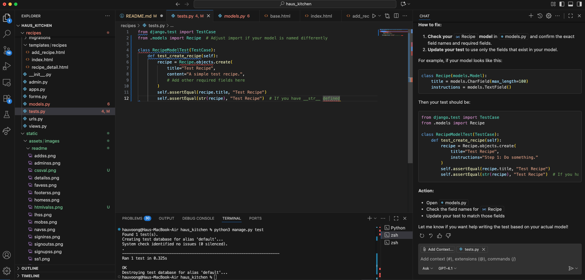

## Python testing
All Python code was tested for PEP8 compatibility with Flake8 via terminal.
No issues.
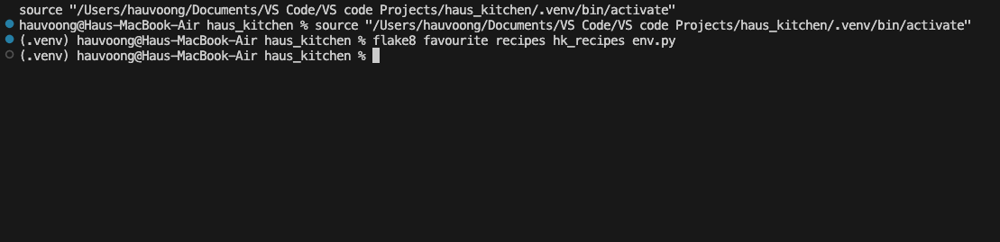

## Entity Relationship Diagram (ERD)
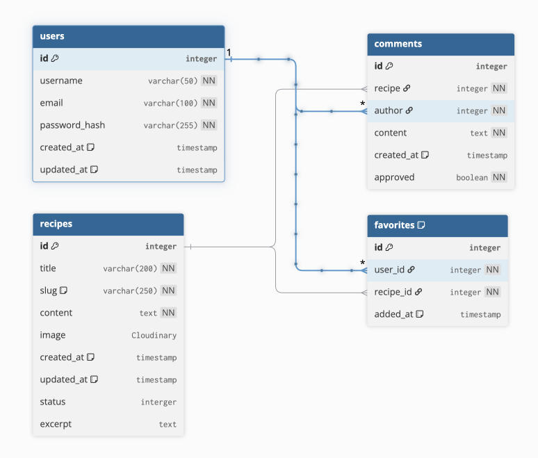
The Entity Relationship Diagram (ERD) illustrates the core data structure of Haus Kitchen. The main entities include `User`, `Recipe`, `Comment`, and `Favorite`. 

- **User**: Primary Key (`id`). Users can create recipes, add comments, and save favorites.
- **Recipe**: Primary Key (`id`). Foreign Key (`user_id`) links each recipe to its creator.
- **Comment**: Primary Key (`id`). Foreign Keys (`user_id`, `recipe_id`) associate comments with both the author and the recipe.
- **Favorite**: Primary Key (`id`). Foreign Keys (`user_id`, `recipe_id`) track which user has favorited which recipe.

**Relationships:**
- One-to-many: A user can have many recipes and comments.
- Many-to-many: Users can favorite multiple recipes, and recipes can be favorited by multiple users (implemented via the `Favorite` table).
- Each comment is linked to a single user and a single recipe.

This structure ensures data integrity and supports efficient querying for user interactions, recipe management, and favorites.

## User Experience Design
Project board for tracking tasks
https://github.com/users/hauvoong/projects/9

## User Stories

These User stories below are what make up my MVP:

### Must have:

<strong>User comments</strong>

As a registered user I want to comment on recipes so that I can share my thoughts with others.

**Acceptance criteria:**
- Add comments to recipes
- Edit comments
- Delete comments
- User must be logged in to access functionality
- Comments are timestamped with author

<strong>Save favourite recipes</strong>

As a registered user, I want to save recipes to my favorites so that I can easily find recipes I want to try later.

**Acceptance Criteria:**
- User can save/unsave recipes
- User must be logged in to save recipes
- User can view all saved recipes on "Favorites" page
- Saved recipes persist across sessions

<strong>Responsive site across all devices</strong>

As a user I want to access all features on my phone, tablet and laptop, so that I can use the website in any scenario.

**Acceptance Criteria:**
- All pages are responsive to any device
- Navigation converts to hamburger menu on mobile
- Recipe instructions display in readable font
- All features work on iOS and Android browsers

<strong>User Registration and Authentication</strong>

As a visitor I want to create an account so that I can access additional functions assigned to my profile, such as favourites and comments.

**Acceptance Criteria:**
- User can register with username and password
- User can log in and log out
- Messaging to confirm you have logged in/out
- Login state: user will see a login/logout button depending on if they are logged in or not

<strong>Admin Content Moderation</strong>

As an administrator I want to moderate user-generated comments so that I can ensure quality and appropriateness. As well as add, edit or delete recipes.

**Acceptance Criteria:**
- Admin dashboard shows recipes, comments
- Admin can approve, edit, or delete comment
- Admin can approve, edit, or delete recipes

<strong>Browse Recipes</strong>

As a visitor I want to browse recipes without logging in so that I can explore the website before creating an account.

**Acceptance Criteria:**
- Homepage displays recipes with instructions
- Recipes are paginated for spacious and breathable content, creating a better experience for the user
- CTA prompts user to sign up when certain functions are clicked which are exclusive to logged in users

<strong>View Recipe Details</strong>

As a user I want to view complete recipe information so that I can follow the instructions to cook the dish

**Acceptance Criteria:**
- Recipe page displays details such as ingredients, instructions
- Detail page can be accessed via home page or favourites

## Wireframes  
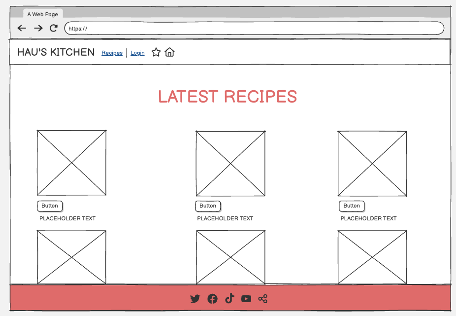
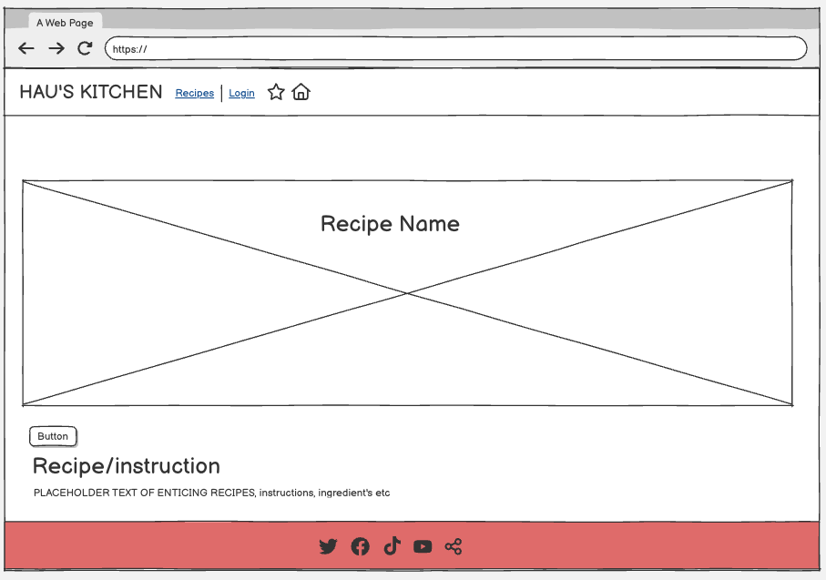
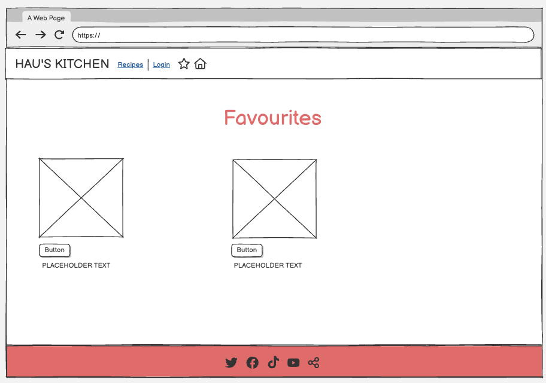
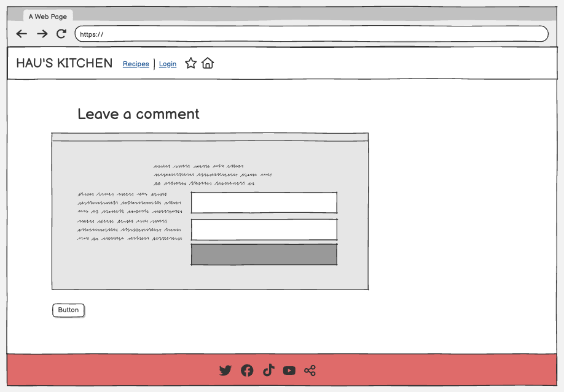
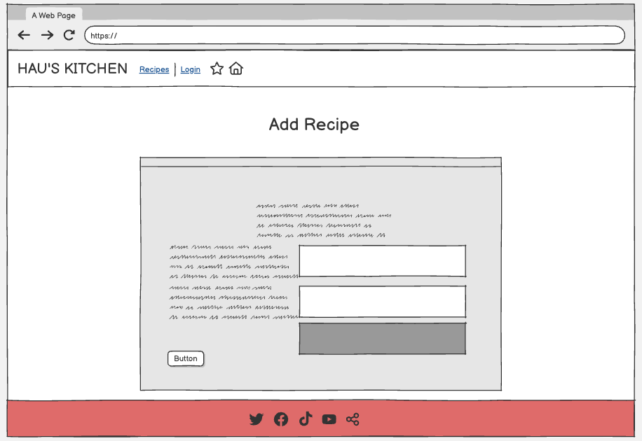
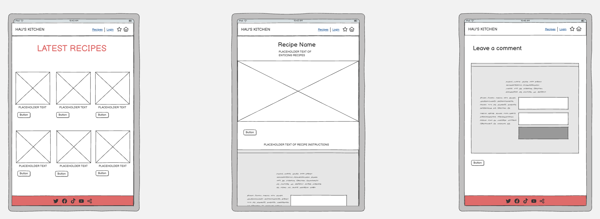
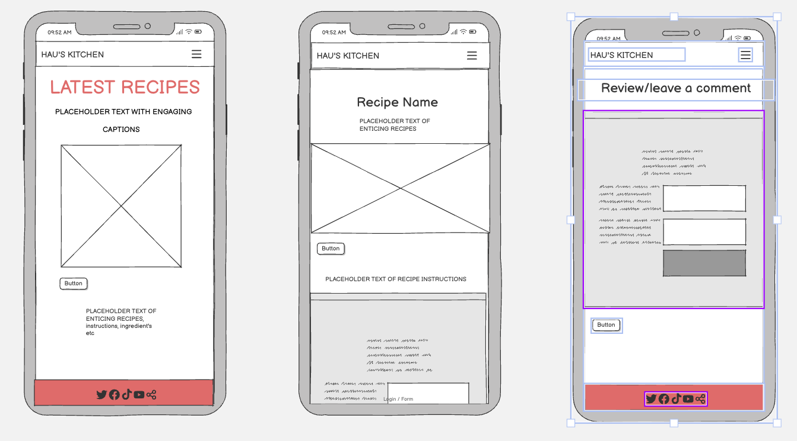

## Bugs
- Integrating Summernote SummernoteTextField() into my recipe model and having incompatibility issues with Bleach. 
Solution: Downgrade Bleach to bleach==4.1.0

- Creating add/remove recipe on the front end: Had multiple errors integrating the function. Managed to integrate and migrate model.
However there is a remaining issue where the Summernote Content box on the Add Recipe page is not responsive and displays outside of mobile screens. I will address this issue later. 

- Remove favourite Modal issue: NoReverseMatch. 
Solution: Update recipe.favourite_id to fav.id
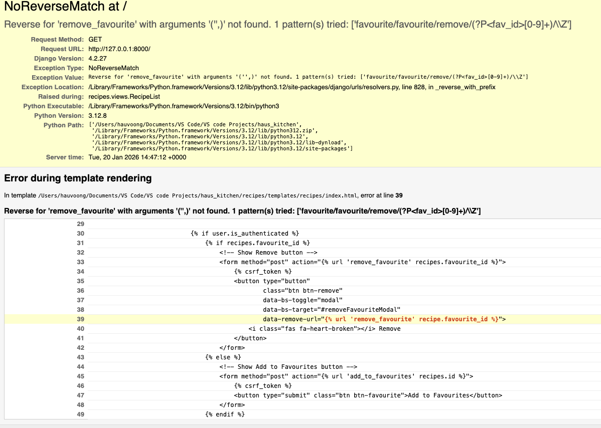

- Links that are hidden from non logged in users/non admin users, throws up error page.
Solution: Add @login_required to the views. Which redirects to sign in page.
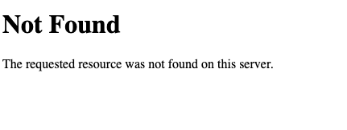

- There were a variety of minor wiring up views/urls/template bugs which Copilot was very helpful in assisting. 

## AI Usage
- Used GitHub Copilot to generate boilerplate code and speed up repetitive coding tasks.
- Leveraged Copilot to assist with debug issues, such as fixing syntax errors and resolving logic bugs in Django views and models.
- Asked Copilot for explanations of unfamiliar code snippets to better understand use.
- Utilised Copilot to brainstorm solutions for implementing new features, like user authentication and recipe management.
- Referenced Copilot's inline documentation and code comments to clarify best practices and improve code quality.
- Use of Copilot in order to decide how best to execute a task most effieciently
- Copilot created and executed python testing 

## Credits
- Code Institute's Codestar walkthrough as the foundation of my site
- https://github.com/mbriscoe for readme ideas
- Recipes from https://www.recipetineats.com/

## Future features
Ratings - A feature where users can rate recipes. I started to implement but ran out of time, so there may be reference to this feature in the codebase.

Search and filter function - User can find a specific recipe based on name

User profile management - Users can login and make adjustments to their profile, add images etc

Catergories via tags - Recipes will be tagged and catergorised so user can look at a certain type of dish based cuisine, nation etc

Seperating the elements of the recipe content. Right now, it is one text box. Eventually it will be broken down to elements such as; ingrediants, instructions, cooking time etc 